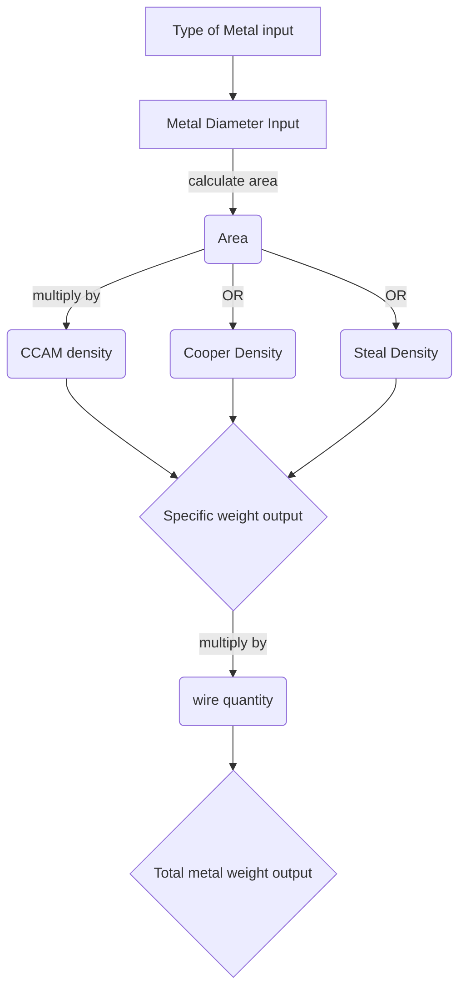

# Specific Weight Calculator for Metal Wires

```

```
## What is it?

  

This project is a metal wire density calculator. It will be used by a cable factory to calculate the ammount of metal required to manufacture any given cable.

  

## How it works?

  

The program takes in four parameter and delivers two results based on them.

  

> The parameters received are:

  

1. The **type of metal**, between three options ` (CCAM (aluminum), Steel or Cooper) `

2. The **diameter** of the wire.

3. The **ammount of wires** of the same diameter that will used to manufacture the cable.

4. The total length of the finished product.

  

> Based on these 4 parameters two results will be calculated:

  

1. The **specific weight**` (measured in kg/km) ` of one metal wire that fits the criteria.

2. The **total metal weight** that will be present in the finished cable.

## Information flow and logic
This is the flow of information to get the desired outpus:


## Tecnologies and concetps used:

  

### **JavaScript:**

Used mainly for backend calculations.

>*Main concepts used:*

1. Functions.

2. Conditionals.

3. Switch statements.

4. DOM events.

  

### **HTML and CSS:**


>*Main concepts used:*

1. Semantic elements.

2. Responsive Design.

3. DOM Events.


### **Markdown:**

- To write README file

  

## Here is the deployed finished program, hope you like it!: [Peso Específico](https://ribeiroallison.github.io/peso-especifico/)


